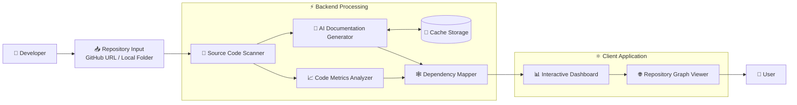

# 🚀 Repository Architecture Analysis & Visualization Platform

An intelligent full-stack application that analyzes local and GitHub repositories to discover project architecture, identify dependencies, compute code quality metrics, and generate AI-powered summaries for enhanced codebase understanding.

---

## 📌 Overview

Large software repositories often consist of numerous interconnected files, making it difficult for developers to understand project architecture, dependencies, and code organization.

The Repository Architecture Analysis & Visualization Platform simplifies repository exploration by automatically:

* Scanning repositories from local storage or GitHub
* Identifying dependencies between source files
* Computing software metrics (LOC & Code Complexity)
* Building interactive dependency visualizations
* Generating AI-powered summaries for source files
* Reducing repeated AI requests through intelligent summary caching

The platform provides developers with a clear architectural overview, enabling faster onboarding, easier maintenance, and improved understanding of complex software projects.

---

## ✨ Features

### Repository Analysis

* Analyze local repositories
* Analyze public GitHub repositories
* Automatic repository cloning and parsing

### Dependency Graph Visualization

* Interactive graph-based architecture visualization
* Dependency relationship mapping
* Complexity-based node coloring
* React Flow powered visualization

### Code Metrics

* Lines of Code (LOC)
* Cyclomatic Complexity (Python)
* Heuristic Complexity Estimation (JS, TS, Java, C, C++)
* Repository Statistics Dashboard

### AI-Powered Insights

* File-level AI summaries using Gemini API
* Click-to-summarize functionality
* Cache-based summary optimization
* Reduced redundant LLM requests

### Multi-Language Support

* Python (.py)
* Jupyter Notebooks (.ipynb)
* JavaScript (.js)
* React (.jsx)
* TypeScript (.ts)
* TSX (.tsx)
* Java (.java)
* C (.c)
* C++ (.cpp, .hpp, .h)

### User Experience

* Light/Dark Theme
* Interactive Node Inspection
* Real-Time Repository Visualization

---

# 🏗️ System Architecture



   

# ⚙️ Technology Stack

## Frontend

| Technology | Purpose             |
| ---------- | ------------------- |
| React      | User Interface      |
| React Flow | Graph Visualization |
| Axios      | API Communication   |

## Backend

| Technology | Purpose                   |
| ---------- | ------------------------- |
| FastAPI    | REST API Backend          |
| Python     | Repository Analysis       |
| GitPython  | GitHub Repository Cloning |

## AI Layer

| Technology | Purpose               |
| ---------- | --------------------- |
| Gemini API | AI Code Summarization |

---

# 🔄 Workflow

1. User submits a GitHub repository URL.
2. Backend clones and analyzes the repository.
3. Source files are parsed.
4. Dependency relationships are extracted.
5. LOC and complexity metrics are computed.
6. Graph data is generated.
7. React Flow visualizes repository architecture.
8. User clicks a file node.
9. Gemini generates an AI summary.
10. Summary is cached for future requests.

---

# 📊 Complexity Analysis Strategy

### Python

Cyclomatic Complexity is calculated using Radon.

### Other Languages

Complexity is estimated using decision-point heuristics:

* if
* else
* for
* while
* switch
* case
* catch
* try

This provides meaningful complexity estimation across multiple languages while maintaining fast analysis speed.

---

# 🧠 Cache Optimization

To reduce redundant LLM requests:

* File hashes are generated
* Previously summarized files are cached
* Repeated requests return cached summaries
* Reduces API costs and latency

Example:

```text
CACHE MISS → Generate Summary → Save Cache
CACHE HIT  → Return Cached Summary
```

---

# 🚀 Installation

## Backend

## 🚀 Installation & Setup

### 1. Clone the Repository

```bash
git clone https://github.com/Urahara0723/Repository-Structure-Analysis-and-Visualisation-System.git

cd Repository-Structure-Analysis-and-Visualisation-System
```

---

### 2. Backend Setup

Create and activate a virtual environment:

```bash
python -m venv venv
```

#### Windows

```bash
venv\Scripts\activate
```

#### Linux / macOS

```bash
source venv/bin/activate
```

Install dependencies:

```bash
pip install -r requirements.txt
```

Create a `.env` file:

```env
GEMINI_API_KEY=your_api_key_here
```

Start the FastAPI server:

```bash
uvicorn app:app --reload
```

Backend runs at:

```text
http://127.0.0.1:8000
```

---

### 3. Frontend Setup

Open a new terminal:

```bash
cd frontend
```

Install dependencies:

```bash
npm install
```

Start the development server:

```bash
npm run dev
```

Frontend runs at:

```text
http://localhost:5173
```

---

### 4. Using the Application

1. Open `http://localhost:5173`
2. Paste a public GitHub repository URL
3. Click **Analyze GitHub Repo**
4. Explore the dependency graph
5. Click any node to generate an AI summary
6. Toggle between Light and Dark mode

---

### Example Repositories

```text
https://github.com/axios/axios

https://github.com/google/googletest

https://github.com/pallets/flask
```

